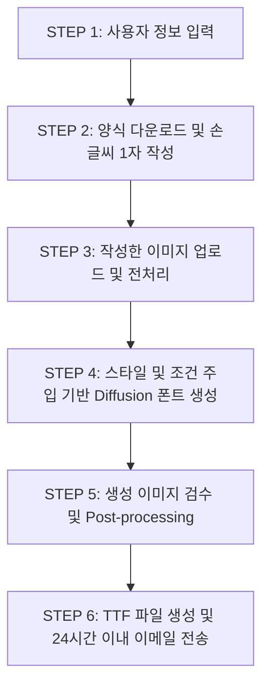
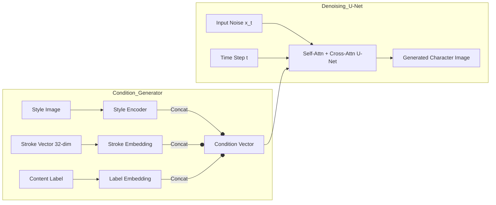

# ✍️ One-Shot Diffusion 한글 손글씨 폰트 생성
> **Self-Attention 기반 조건 주입(Condition Injection) 방식 비교 연구**
> 
> 본 프로젝트는 단 **한 글자**의 손글씨만으로 사용자의 고유한 필체를 보존하면서, 한국어 특성(초성·중성·종성 조합)을 반영한 **손글씨 폰트 한 벌(11,172자)**을 24시간 내에 생성하는 One-Shot Diffusion 기반 폰트 제작 파이프라인 및 서비스 백엔드입니다.

---

## 📌 목차
1. [기획 배경 및 문제 해결](#-기획-배경-및-문제-해결)
2. [서비스 시나리오](#-서비스-시나리오)
3. [데이터셋 구축 및 프로세싱](#-데이터셋-구축-및-프로세싱)
4. [모델 아키텍처](#-모델-아키텍처)
5. [실험 및 결과 분석](#-실험-및-결과-분석)
6. [검수 및 후처리 파이프라인](#-검수-및-후처리-파이프라인)
7. [프로젝트 디렉토리 구조](#-프로젝트-디렉토리-구조)
8. [시작 가이드](#-시작-가이드)

---

## 💡 기획 배경 및 문제 해결

### 기존 폰트 제작의 한계
* **수작업 제작**: 표준 한글 2,350자(외계어 포함 시 11,172자)를 수작업으로 제작하는 데 **평균 6~24개월**의 기간과 **약 2,000만 원**의 큰 비용 부담이 발생합니다.
* **기존 AI 폰트 제작**: 폰트 생성을 위해 **최소 80자 이상**의 손글씨 입력이 필요하여 사용자 진입 장벽이 높습니다. 또한 초성·중성·종성의 위치에 따라 자모의 형태가 변하는 한글의 조합적 특성을 충분히 반영하지 못해 생성 품질이 저하되는 문제가 있습니다.

### One-Shot Diffusion의 해결책
* **최소한의 입력**: 단 **1글자**의 손글씨 샘플만 작성하면 즉시 제작을 시작할 수 있습니다.
* **한국어 특성 반영**: 초성·중성·종성 위치 정보를 반영하는 **신규 획 임베딩(Stroke Embedding)**을 제안하여, 자모 위치에 따라 형태가 균일하고 자연스럽게 변화하는 폰트를 생성합니다.
* **빠른 제작 및 저비용**: Diffusion 모델 및 자동화 파이프라인을 통해 **24시간 이내**에 고품질 폰트를 완성 및 전송합니다.

---

## 🎬 서비스 시나리오



1. **사용자 정보 입력**: 사용자의 기본 정보 및 이메일을 입력합니다.
2. **양식에 손글씨 1자 작성**: 지정된 글자(예: '했')의 가이드라인에 맞추어 손글씨를 작성합니다.
3. **이미지 업로드**: 작성된 이미지 파일을 플랫폼에 업로드합니다.
4. **폰트 생성 및 전송**: Diffusion 기반 폰트 이미지 생성 -> 검수 및 Super Resolution 처리 -> TTF 빌드 -> 24시간 내 이메일 전송의 흐름으로 진행됩니다.

---

## 📊 데이터셋 구축 및 프로세싱

### 1. 폰트 수집 (Make Dataset)
* **대상**: 눈누(noonnu) 사이트 등에서 수집한 OFL(Open Font License) 및 상업적 이용 가능 폰트 **총 250종**.
* **클래스 구성**: 손글씨 스타일을 포함한 **8개 클래스**로 세분화.
* **이미지 생성**: Pillow 라이브러리를 통해 각 TTF 파일에서 **64×64 크기**의 Grayscale PNG 글자 이미지 추출. 
* **필터링**: 폰트에 없는 글자의 경우 네모(□) 혹은 X 표시로 출력되는 문제를 방지하기 위해, 글자 박스의 상하/좌우 차이가 0인 이미지를 자동 제외하는 필터링 코드 적용.
* **총 데이터 수**: **2,677,325장**의 학습 이미지 구축.

### 2. Small Dataset 구축 전략
* **배경**: 전체 데이터셋 학습 시 약 115일(300 epoch 기준) 소요되어 모델 설계 및 구현의 빠른 검증이 불가능.
* **전략**: 자음과 모음의 비율을 실제 한글 분포와 유사하게 샘플링하여 **420개의 대표 라벨**을 선정.
  * *25개 라벨 적용 시*: 특정 획(Stroke)에 과적합(Overfitting) 발생 및 붕괴 현상 관측.
  * *420개 라벨 적용 시*: 학습 시간은 약 **3.5일**로 단축되면서도 모든 획이 균일하게 학습 및 생성됨을 확인.

### 3. 중국어 데이터셋 확장 (Chinese Dataset)
* **조합 문자 분석**: 중국어 역시 한글처럼 여러 획(Stroke)이 조합되어 글자를 이루는 구조를 가짐.
* **자체 라벨링 툴(Labeling Tool)** 제작: 획 분해 속도 및 효율성을 높이기 위해 자체 GUI 툴을 개발하여 라벨링 시간을 **2.5배 개선** (15개당 1시간 ➡️ 24분).

---

## 🧠 모델 아키텍처

본 프로젝트는 Diffusion U-Net 구조를 기반으로 **Style(필체 스타일)**, **Content(지정 글자 뼈대)**, **Stroke(획의 위치 및 종류)** 세 가지 조건을 효과적으로 융합하는 **Self-Attention 조건 주입 구조**를 설계했습니다.



### 1. 스타일 인코더 (Style Encoder) 아키텍처
참조 손글씨 이미지에서 필체의 스타일 특징을 전역적/국소적으로 추출하기 위해 아래의 레이어 구성을 설계했습니다:
* **구조**: `ConvBlock(C_in → C)` ➡️ `ConvBlock(C → 2C, down)` ➡️ `GCBlock(2C)` ➡️ `ConvBlock(2C → 4C, down)` ➡️ `CBAM(4C)`
* **핵심 기능**:
  * **GCBlock (Global-Context Block)**: 글자 전체의 전역 문맥을 파악하여 필체의 큰 흐름을 이해.
  * **CBAM (Convolutional Block Attention Module)**: 채널 및 공간 어텐션을 통해 스타일을 드러내는 중요 획의 상세 영역을 강조.

### 2. 신규 획 임베딩 (New Stroke Embedding)
* **기존 방식**: 자모의 개수만 세어 임베딩 벡터로 전달하여, 자모의 '위치 정보'가 누락됨 (초성/종성 위치에 따라 자모 모양이 달라져야 하나 이를 반영하지 못함).
* **개선 방식**: 초성·중성·종성을 철저히 구분하여 획을 개별 임베딩.
* **차원 및 표현**: 5가지 타입(Type), 11가지 클래스(Class)를 조합한 **총 32가지의 Stroke**로 풍부하게 위치 및 조합 특성을 수치화해 모델에 주입.

### 3. Self-Attention U-Net 구조 및 조건 주입 방식
* **U-Net 레이어 구성**: 64×64 흑백 입력($c_{in}=1, c_{out}=1$)을 받아 노이즈를 예측하는 대칭형 구조입니다. 레이어 세부 스펙은 아래와 같습니다:
  
  | 단계 | 레이어 명칭 | 채널 변화 (Channels) | 해상도 (Resolution) | Self-Attention 주입 여부 |
  | :--- | :--- | :--- | :--- | :--- |
  | **Input** | DoubleConv | 1 ➡️ 64 | 64² | — |
  | **Down 1** | Down + sa1 | 64 ➡️ 128 | 32² | ✅ (128) |
  | **Down 2** | Down + sa2 | 128 ➡️ 256 | 16² | ✅ (256) |
  | **Down 3** | Down + sa3 | 256 ➡️ 256 | 8² | ✅ (256) |
  | **Bottleneck**| DoubleConv ×3 | 256 ➡️ 512 ➡️ 256 | 8² | — |
  | **Up 1** | Up + sa4 | 512 ➡️ 128 | 16² | ✅ (128) |
  | **Up 2** | Up + sa5 | 256 ➡️ 64 | 32² | ✅ (64) |
  | **Up 3** | Up + sa6 | 128 ➡️ 64 | 64² | ✅ (64) |
  | **Output** | Conv 1×1 | 64 ➡️ 1 | 64² | — |

* **조건 및 시간 정보 주입 방식**:
  * **시간 단계 임베딩 ($t$)**: 256차원의 사인·코사인 위치 인코딩(Sinusoidal Positional Encoding)으로 변환 후 주입.
  * **조건 벡터 (CharAttr = Content + Stroke + Style)**: 총 296차원으로 구성되며, SiLU 및 Linear Projection 레이어를 거친 후 U-Net 특징맵에 결합됩니다:
    $$\text{Output} = x + \text{embedding}(t) + \text{projection}(\text{CharAttr})$$
  * **Style 투영 방식 비교 실험**: Denoising 과정에서 조건 벡터를 투영하는 구조를 Linear, Conv2d, GAP(Global Average Pooling) 세 가지로 나누어 검증을 진행했습니다.

---

## 🔬 실험 및 결과 분석

### 1. 조건 투영(Projection) 방식 비교 (wandb를 통한 27 runs 분석)
| 실험 구성 (Condition: content+stroke+style) | Projection 방식 | 학습 시간 | 결과 요약 및 특징 |
| :--- | :--- | :--- | :--- |
| **Label Only (Baseline)** | t-emb | — | 기준선 |
| **Self-Attn (GAP)** | **GAP** | **11시간 41분** | **최우수 (획이 매우 균일하고 전체 구조가 가장 안정적)** |
| **Self-Attn (Linear)** | **Linear** | **14시간 27m** | **우수 (2위, 선명도가 뛰어나 디테일 정보를 효과적으로 보존)** |
| **Self-Attn (Conv2d)** | **Conv2d** | **14시간 20m** | **실패 (형태 왜곡 및 글자 구조가 붕괴되는 이상 현상 발생)** |
| **Self-Attn (Conv2d + SiLU)** | Conv2d + SiLU | 21시간 55m | 일부 글자만 생성되며, 연산이 매우 느림 |
| **ResBlock U-Net (Cross-Attn)** | Linear | — | 얇은 폰트 표현에서 상대적으로 뛰어남 |

> [!TIP]
> **투영 방식 선택 가이드**: 
> * 전체적인 획의 균일성과 형태 안정성을 높이려면 **GAP(Global Average Pooling)** 방식을 권장합니다.
> * 필체의 날카로운 모서리나 디테일 표현을 더 선명하게 보존하고자 한다면 **Linear** 방식을 권장합니다.

### 2. 정량 평가 결과 (타 모델 대비 성능)
SSIM(구조적 유사도), RMSE(평균제곱오차), LPIPS(인지적 유사도), FID(생성 품질)를 기준으로 성능을 비교했습니다. (**Bold** = 최고 성능)

* **Small Dataset** (420 Labels)
  * FUNIT: SSIM 0.700 / RMSE 0.303 / LPIPS 0.166 / FID 35.20
  * MX-Font: SSIM 0.721 / RMSE 0.283 / LPIPS 0.151 / FID 37.15
  * DG-Font: SSIM 0.729 / RMSE 0.280 / LPIPS 0.137 / FID 43.44
  * **FMF-Font (Ours)**: **SSIM 0.742** / **RMSE 0.271** / **LPIPS 0.124** / **FID 27.30**

* **Large Dataset** (Full Dataset)
  * FUNIT: SSIM 0.682 / RMSE 0.311 / LPIPS 0.166 / FID 26.70
  * MX-Font: SSIM 0.692 / RMSE 0.298 / LPIPS 0.138 / FID 26.64
  * DG-Font: SSIM 0.709 / RMSE 0.292 / LPIPS 0.112 / FID 28.63
  * **FMF-Font (Ours)**: **SSIM 0.722** / **RMSE 0.277** / **LPIPS 0.104** / **FID 16.20**

> [!IMPORTANT]
> **주요 성과**: 본 연구의 **FMF-Font** 모델은 Small 및 Large Dataset 평가 모두에서 타 모델을 크게 상회하며 **모든 성능 지표에서 최고 성적(SOTA)**을 기록했습니다.

### 3. 공통 난제 및 발견점
* **폰트 두께(Thickness)**: 두꺼운 필체의 경우 획이 뚜렷하여 생성 품질이 우수한 반면, 매우 얇은 필체는 64×64 저해상도 환경에서 획 끊김 및 일부 디테일 누락 현상이 공통적으로 관찰되었습니다. 이를 해결하기 위해 추후 데이터 해상도 다변화 및 후처리 기술이 요구됩니다.

---

## 🔍 검수 및 후처리 파이프라인

### 1. 자동 검수 (OCR Inspection)
* 생성되는 11,172자 전체를 수동으로 검수하는 것은 불가능하므로 **Naver CLOVA OCR API**를 활용한 검수 자동화 시스템을 구축했습니다.
* **검수 방식**: 생성된 글자 이미지를 OCR로 인식하여 매칭 결과가 주입 라벨 정보와 완벽히 일치하는 경우 패스합니다.
* **현존 이슈**:
  1. OCR 엔진의 오인식 문제 (정상적으로 생성된 '웜' 글자를 '웡'으로 잘못 인식하여 유효한 이미지를 드랍하는 현상)로 인해 수동 검수 과정(v1.5)이 일부 병행됨.
  2. 1회 전체 검수(11,172자) 시 약 3만 원 상당의 비용이 청구되어 잦은 반복 검수 시 경제적 부담 발생.
  * **향후 계획 (v2.0)**: 비용 절감과 특화 성능 향상을 위해 오픈소스 기반의 **자체 OCR 모델 파인튜닝 및 탑재** 예정.

### 2. 전처리 & 후처리 (Pre / Post Processing)
* **전처리 (Pre)**: 사용자 입력 손글씨 이미지의 약 60% 가량이 그림자 및 외부 노이즈를 포함하고 있습니다. 이를 해결하기 위해 배경 노이즈 제거 및 중앙 정렬 알고리즘을 수행합니다.
* **후처리 (Post)**: 64×64 모델 출력 이미지의 화질 열화(degraded) 문제를 극복하기 위해, **Super Resolution(초해상도)** 네트워크를 연결하여 부드럽고 가독성 높은 백터 변환 직전의 고화질 이미지를 획득합니다.

### 3. 자체 평가 지표 (Service Score)
기존의 정량지표(SSIM, LPIPS 등)는 실제 사용자가 느끼는 '필체의 자연스러움'을 완전히 평가하기 어렵습니다. 따라서 아래의 결합식을 설계하여 최종 서비스 만족도를 평가합니다.

$$\text{Service Score} = \text{SSIM} \times \text{LPIPS} \times \text{User Preference Score (1}\sim\text{5점)}$$

---

## 📂 프로젝트 디렉토리 구조

```directory
├── Backend/                   # 백엔드 API 서버 (FastAPI)
│   ├── app/
│   │   ├── database/          # MongoDB 연결 및 초기화
│   │   ├── library/           # 이미지 처리 및 설정 로더
│   │   ├── models/            # Pydantic 데이터 모델
│   │   ├── routers/           # API 라우터 (사용자/요청)
│   │   └── main.py            # 백엔드 진입점
│   └── docker.file            # 컨테이너 배포를 위한 Dockerfile
├── TTF/                       # TTF 폰트 생성 및 인스턴스 서버
│   ├── png2ttf.py             # potrace & fontforge 활용 PNG to TTF 변환 모듈
│   ├── main.py                # TTF 생성 API (FastAPI)
│   ├── config.yaml            # DB 및 API URL 바인딩 설정
│   └── make_sample_img.py     # 생성된 TTF 폰트를 활용한 예제 이미지 제작
├── ML/                        # 머신러닝 Diffusion 폰트 생성 파트
│   ├── models/                # UNet, StyleEncoder, CBAM, Self-Attention 모델 정의
│   ├── modules/               # Dataloader 및 Diffusion 가중치 연산
│   ├── config/                # 학습/테스트 파라미터 (train.yaml, test.yaml)
│   ├── weight/                # pre-trained weight (style_enc.pth)
│   ├── train.py               # 모델 학습 실행 파일
│   └── test.py                # 모델 생성 및 테스트 추론
├── Tools/                     # 유틸리티 도구 모음
│   ├── DataImbalance/         # 데이터 불균형 및 획 개수 불균형 분석 도구
│   ├── MakeFont/              # 학습 데이터 이미지 생성 및 중국어 샘플링 툴
│   ├── MakeTTF/               # 로컬 테스트용 PNG-to-TTF 변환 코드
│   ├── Metric/                # 생성 폰트의 정량적 평가 (Score_Metric.py)
│   └── OCR/                   # CLOVA OCR 연동 검사 모듈
└── [Frontend]                 # Next.js 웹 프론트엔드 (별도 레포지토리에서 관리)
```

